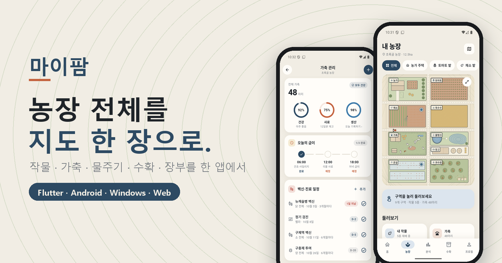
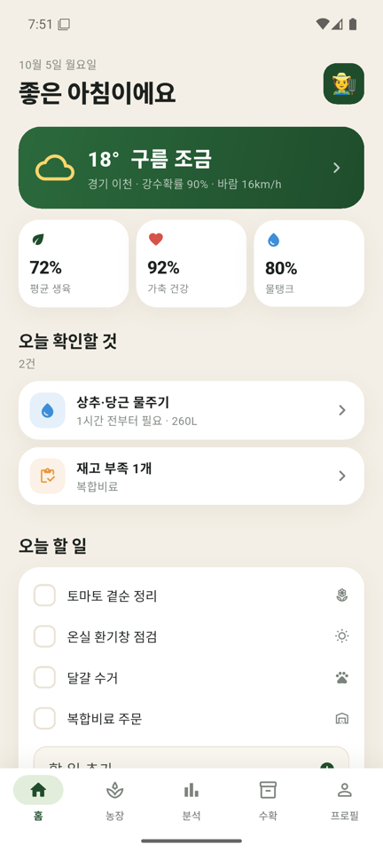
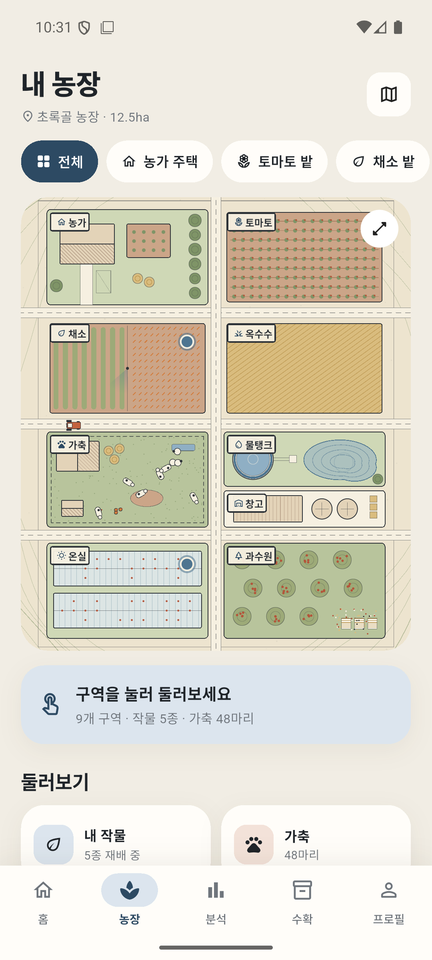
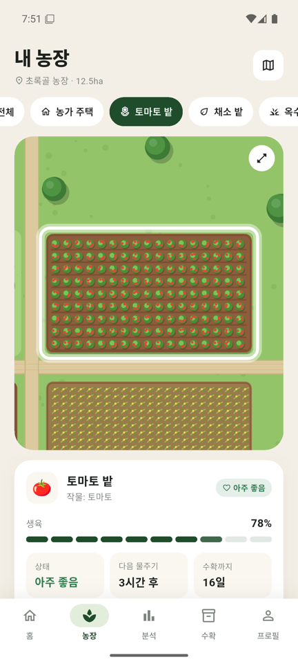
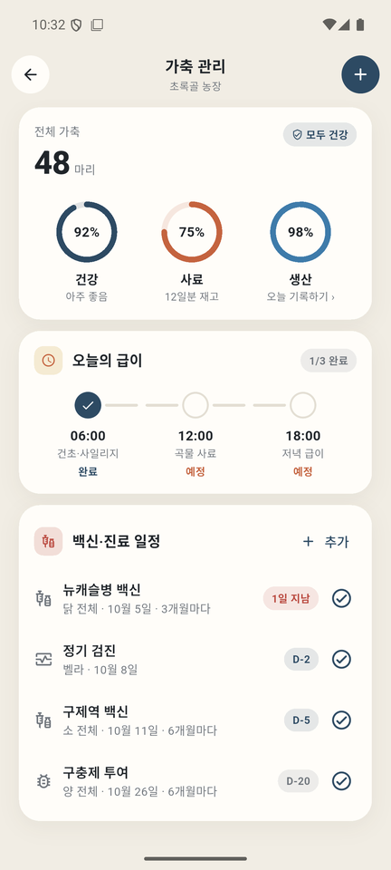
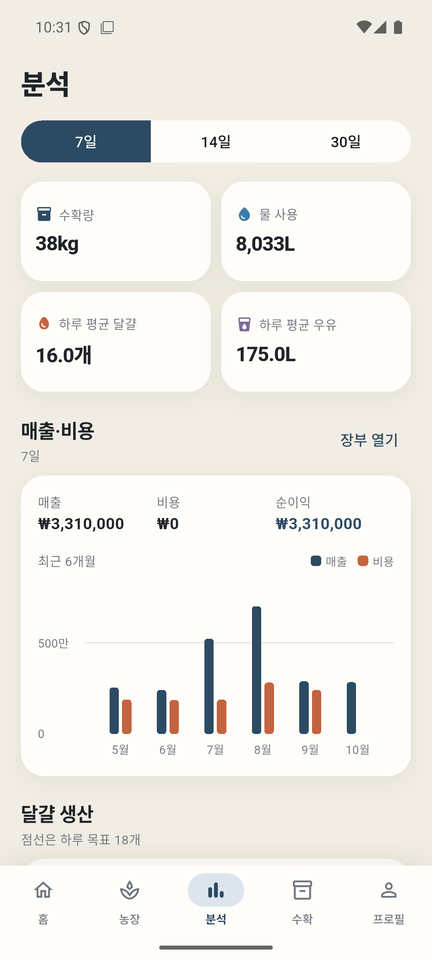
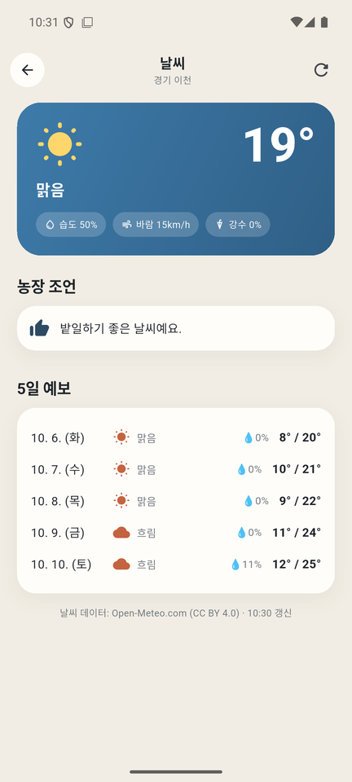
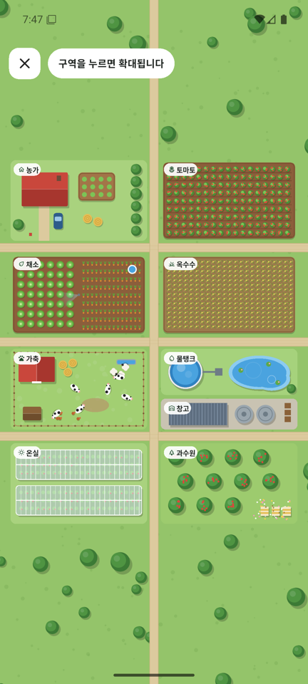
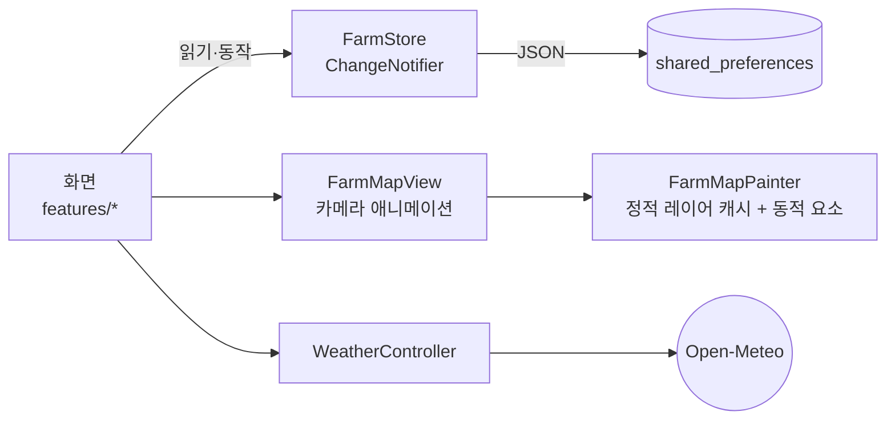

<div align="center">



# 🌾 마이팜 · My Farm

**위에서 내려다본 농장 지도로 작물 · 가축 · 물주기 · 수확 · 재고를 관리하는 Flutter 앱**

[](https://github.com/jeiel85/my-farm-flutter/actions/workflows/ci.yml)
[](https://jeiel85.github.io/my-farm-flutter/)


[](LICENSE)

### [▶ 브라우저에서 바로 체험하기](https://jeiel85.github.io/my-farm-flutter/)

설치도 가입도 필요 없어요. 예시 농장이 채워진 상태로 열립니다.

</div>

---

## ✨ 한눈에 보기

구역 칩이나 지도를 누르면 **카메라가 그 구역으로 부드럽게 날아갑니다.** 목장에서는 소·양·닭이 거닐고, 길에는 트랙터가 지나가고, 연못에는 물결이 일어요. 지도와 동물은 그림 파일 없이 모두 코드(`CustomPainter`)로 그렸습니다.

<table>
  <tr>
    <td align="center"><br><sub><b>홈</b> · 오늘 확인할 것</sub></td>
    <td align="center"><br><sub><b>농장 지도</b> · 9개 구역</sub></td>
    <td align="center"><br><sub><b>구역 확대</b> · 생육·물주기</sub></td>
    <td align="center"><br><sub><b>가축 관리</b> · 급이 타임라인</sub></td>
  </tr>
  <tr>
    <td align="center"><br><sub><b>분석</b> · 생산·물 사용</sub></td>
    <td align="center"><br><sub><b>날씨</b> · 작업 조언</sub></td>
    <td align="center"><br><sub><b>전체 화면 지도</b></sub></td>
    <td align="center" valign="middle"><sub>더 많은 화면은<br><a href="https://jeiel85.github.io/my-farm-flutter/">라이브 데모</a>에서</sub></td>
  </tr>
</table>

## 🧑‍🌾 기능

| | 기능 | 설명 |
| :-: | --- | --- |
| 🗺️ | **살아 있는 농장 지도** | 농가·토마토·채소·옥수수·가축·물탱크·창고·온실·과수원 9개 구역. 고르면 카메라 이동 + 테두리 강조, 물이 필요한 밭엔 파란 점이 깜빡여요. |
| 🐄 | **가축 관리** | 건강·사료·생산 원형 게이지, 하루 세 번 급이 타임라인(눌러서 완료), 소·닭·양·염소 48마리의 건강 점수·체중·검진 기록. |
| 🚚 | **입식 · 출하 · 폐사** | 새 가축을 들이고(태그 자동 제안), 상세 화면에서 출하·폐사를 처리하면 목록에서 빠지고 이름·태그·메모가 기록으로 남아요. 이번 달 건수도 함께 보여 줍니다. |
| 💧 | **물주기 · 스마트 관수** | 밭마다 관수 주기와 1회 사용량이 있고 물탱크에서 차감돼요. 스마트 관수는 2시간 안에 물이 필요한 밭만 골라 탱크가 허락하는 만큼 물을 줍니다. |
| 🧺 | **수확 · 재파종** | 작물별 수확량을 기록하고, 원하면 같은 밭에 바로 다시 심어 생육률을 0%부터 다시 계산해요. |
| 🥚 | **생산 기록** | 하루 달걀·우유 생산량을 목표와 비교합니다. |
| 📦 | **재고** | 사료·종자·비료·자재 입고/사용, 하루 소비량으로 남은 일수 계산, 부족 알림. |
| ⛅ | **날씨 · 작업 조언** | 농장 위치의 현재 날씨와 5일 예보. 비·폭염·서리·강풍이면 관수와 가축 관리 조언을 띄워요. |
| ✅ | **오늘 할 일 · 확인할 것** | 물주기·급이 지연·수확 가능·재고 부족·관리 필요 가축을 홈에 자동으로 모아 줍니다. |
| 📊 | **분석** | 7/14/30일 달걀·우유 추이(목표선), 일별 물 사용량, 작물별 누적 수확. |

> 💡 인스타그램의 "Flutter로 만든 농장 앱 UI" 영상에서 영감을 받아 화면 구성을 처음부터 다시 구현했고, 영상에 없던 온실·과수원·물탱크 연동·수확·생산·재고·날씨·할 일·분석을 더했습니다. 앞으로 넣을 만한 요소는 [BACKLOG.md](BACKLOG.md)에 있어요.

## 📲 실행하기

| 플랫폼 | 방법 |
| --- | --- |
| 🌐 **웹** | [jeiel85.github.io/my-farm-flutter](https://jeiel85.github.io/my-farm-flutter/) — 데이터는 브라우저(localStorage)에만 저장돼요. |
| 🤖 **Android** | `flutter build apk --release` (서명 설정은 아래 참고) |
| 🪟 **Windows** | `flutter build windows --release` → `build/windows/x64/runner/Release/` 폴더째 실행(`MyFarm.exe`). 빌드하려면 Windows **개발자 모드**가 켜져 있어야 해요(플러그인 심볼릭 링크). |

```bash
git clone https://github.com/jeiel85/my-farm-flutter.git
cd my-farm-flutter
flutter pub get
flutter run
```

## 🛠️ 기술 스택

| 영역 | 선택 | 이유 |
| --- | --- | --- |
| 프레임워크 | **Flutter 3.47** (Dart 3.13) | 원본이 iOS 시뮬레이터에서 시연된 Flutter 앱이라, 같은 코드로 Android·Windows·웹을 모두 그리는 쪽을 택했어요. |
| 렌더링 | `CustomPainter` + `ui.Picture` 캐시 | 움직이지 않는 지형·작물은 한 번만 그려 재사용하고, 동물·트랙터·물결만 매 프레임 그립니다. |
| 상태 | `ChangeNotifier` + `InheritedNotifier` | 화면 수에 비해 상태가 단순해서 별도 상태관리 패키지 없이 충분해요. |
| 저장 | `shared_preferences` (JSON + `schemaVersion`) | 기기 안에만 저장. 읽을 수 없는 저장본은 지우지 않고 따로 보관한 뒤 예시 농장으로 시작합니다. 새 항목은 **키 추가만** 하고 없으면 빈 값으로 읽어 `schemaVersion`을 올리지 않아요(1.2.0 `animalEvents`). 올리면 이전 버전 앱이 새 저장본을 손상본으로 처리하기 때문이에요. |
| 애니메이션 | `flutter_animate`, 암시적 애니메이션 | 목록 진입, 카드 전환, 게이지 차오름 |
| 차트 | `fl_chart` | 생산 추이, 물 사용량 |
| 날씨 | [Open-Meteo](https://open-meteo.com/) | 무료, API 키 불필요 (CC BY 4.0, 앱 안에 출처 표기) |
| CI/CD | GitHub Actions | 포맷·분석·테스트, 웹 데모를 Pages로 배포 |



<details>
<summary><b>📁 폴더 구조</b></summary>

```
lib/
  main.dart, app_shell.dart        앱 시작, 하단 탭, 넓은 화면은 휴대폰 폭으로 가운데 정렬
  core/                            테마, 공통 위젯, 가축 아이콘 painter
  data/                            모델, 저장(FarmStore), 예시 데이터, 날씨
  features/
    farm/                          농장 지도(farm_world.dart: 지형·애니메이션, farm_map_view.dart: 카메라)
    livestock/ crops/ harvest/ analytics/ inventory/ weather/ home/ profile/
site/                              GitHub Pages 랜딩 페이지
test/                              상태 로직·날씨 파싱·앱 스모크 테스트
```

</details>

<details>
<summary><b>🔐 Android 릴리스 서명</b></summary>

서명 정보가 없으면 디버그 키로 조용히 대체하지 않고 빌드를 멈춥니다. 값은 환경변수가 우선이고, 없으면 저장소 루트의 `.keystore/release-signing.properties`(커밋 금지, `.gitignore` 처리)를 읽어요.

| 환경변수 | properties 키 | 기본값 |
| --- | --- | --- |
| `KEYSTORE_PATH` | `keystorePath` | `../.keystore/my-farm-upload.jks` (android/ 기준) |
| `STORE_PASSWORD` | `storePassword` | 없음(필수) |
| `KEY_ALIAS` | `keyAlias` | `my-farm` |
| `KEY_PASSWORD` | `keyPassword` | 없음 |

Windows에서 Pub 캐시(C:)와 프로젝트(D:)의 드라이브가 다르면 Kotlin 증분 컴파일 캐시가 실패해서 `android/gradle.properties`에 `kotlin.incremental=false`를 넣어 두었습니다.

</details>

## 🔒 데이터와 개인정보

- 모든 기록은 **기기(또는 브라우저) 안에만** 저장돼요. 계정·분석·광고 SDK가 없습니다.
- 네트워크는 날씨 조회에만 쓰고, 프로필에 입력한 **위도·경도만** Open-Meteo로 전송됩니다.
- 처음 열면 예시 농장 "초록골 농장"이 채워져 있어요. 프로필 → **예시 농장으로 초기화**로 언제든 되돌릴 수 있습니다.

## 🗺️ 로드맵

- 하드닝 후보: [#1 Hardening candidates: v1.0.0](https://github.com/jeiel85/my-farm-flutter/issues/1) (데이터 백업, 영어 UI, 접근성 등)
- 농장 요소 아이디어: [BACKLOG.md](BACKLOG.md) (백신 알림, 병해충 기록, 매출 장부 …)
- 변경 이력: [CHANGELOG.md](CHANGELOG.md)

## 📄 라이선스

[MIT](LICENSE) © 2026 jeiel85 · 날씨 데이터 © [Open-Meteo.com](https://open-meteo.com/) (CC BY 4.0)
