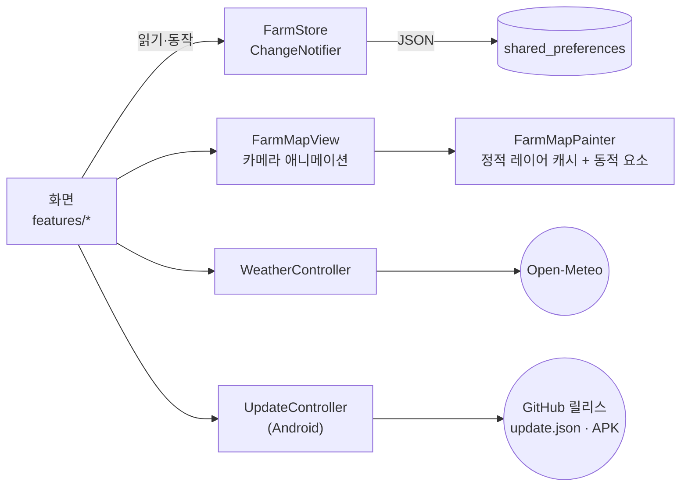

<div align="center">


# 🌾 마이팜 · My Farm

**위에서 내려다본 농장 지도로 작물 · 가축 · 물주기 · 수확 · 재고를 관리하는 Flutter 앱**

[](https://github.com/jeiel85/my-farm-flutter/actions/workflows/ci.yml)
[](https://jeiel85.github.io/my-farm-flutter/)


[](LICENSE)

### [▶ 브라우저에서 바로 체험하기](https://jeiel85.github.io/my-farm-flutter/)

설치도 가입도 필요 없어요. 예시 농장이 채워진 상태로 열립니다.

<sub>🇺🇸 A farm-management app built with Flutter: a top-down animated farm map, livestock, watering, harvests and inventory. The UI is available in Korean and English (follows your device language, or pick one in Profile).</sub>

</div>

---

## ✨ 한눈에 보기

구역 칩이나 지도를 누르면 **카메라가 그 구역으로 부드럽게 날아갑니다.** 목장에서는 소·양·닭이 거닐고, 길에는 트랙터가 지나가고, 연못에는 물결이 일어요. 지도와 동물은 그림 파일 없이 모두 코드(`CustomPainter`)로 그렸습니다.

<table>
  <tr>
    <td align="center"><br><sub><b>홈</b> · 오늘 확인할 것</sub></td>
    <td align="center"><br><sub><b>농장 지도</b> · 9개 구역</sub></td>
    <td align="center"><br><sub><b>구역 확대</b> · 생육·물주기</sub></td>
    <td align="center"><br><sub><b>가축 관리</b> · 급이 타임라인</sub></td>
  </tr>
  <tr>
    <td align="center"><br><sub><b>분석</b> · 생산·물 사용</sub></td>
    <td align="center"><br><sub><b>날씨</b> · 작업 조언</sub></td>
    <td align="center"><br><sub><b>전체 화면 지도</b></sub></td>
    <td align="center" valign="middle"><sub>더 많은 화면은<br><a href="https://jeiel85.github.io/my-farm-flutter/">라이브 데모</a>에서</sub></td>
  </tr>
</table>

## 🧑‍🌾 기능

| | 기능 | 설명 |
| :-: | --- | --- |
| 🗺️ | **살아 있는 농장 지도** | 농가·토마토·채소·옥수수·가축·물탱크·창고·온실·과수원 9개 구역. 고르면 카메라 이동 + 테두리 강조, 물이 필요한 밭엔 파란 점이 깜빡여요. |
| 🐄 | **가축 관리** | 건강·사료·생산 원형 게이지, 하루 세 번 급이 타임라인(눌러서 완료), 소·닭·양·염소 48마리의 건강 점수·체중·검진 기록. |
| 💧 | **물주기 · 스마트 관수** | 밭마다 관수 주기와 1회 사용량이 있고 물탱크에서 차감돼요. 스마트 관수는 2시간 안에 물이 필요한 밭만 골라 탱크가 허락하는 만큼 물을 줍니다. |
| 🧺 | **수확 · 재파종** | 작물별 수확량을 기록하고, 원하면 같은 밭에 바로 다시 심어 생육률을 0%부터 다시 계산해요. 판매 금액을 적으면 장부에도 함께 남아요. |
| 🥚 | **생산 기록** | 하루 달걀·우유 생산량을 목표와 비교합니다. |
| 📦 | **재고** | 사료·종자·비료·자재 입고/사용, 하루 소비량으로 남은 일수 계산, 부족 알림. 급이를 완료하면 사료가 자동으로 빠져요. |
| 🏷️ | **입식 · 출하 · 폐사** | 새 가축을 들이면 번호표가 자동으로 붙고, 출하·폐사 처리해도 이력은 남아요. |
| 💉 | **백신 · 진료 일정** | 종 전체나 개체별 백신·검진·구충 일정과 반복 주기. 완료하면 다음 일정이 자동으로 잡히고, 다가오거나 지난 일정은 홈에 떠요. |
| 💰 | **매출 · 비용 장부** | 작물·가축·우유·달걀 판매와 사료·종자·인건비 같은 비용을 적고, 달별 순이익과 분류별 합계, 최근 6개월 차트로 봐요. 기록을 눌러 고치고, CSV로 내보내 엑셀에서 열 수 있어요. 통화는 프로필에서 골라요. |
| 💾 | **백업 · 복원** | 전체 기록을 JSON 파일로 내보내고 다른 기기나 PC·웹 버전에서 복원할 수 있어요. 오래 백업하지 않으면 홈에서 알려 줘요. |
| ⛅ | **날씨 · 작업 조언** | 농장 위치의 현재 날씨와 5일 예보. 비·폭염·서리·강풍이면 관수와 가축 관리 조언을 띄워요. 연결이 안 되면 마지막으로 받은 날씨(최대 3일)를 보여 줘요. |
| ✅ | **오늘 할 일 · 확인할 것** | 물주기·급이 지연·수확 가능·재고 부족·관리 필요 가축을 홈에 자동으로 모아 줍니다. |
| 🖥️ | **PC · 태블릿 가로 배치** | 창이 넓으면 왼쪽 메뉴와 두 열 화면으로 바뀌어요(Windows 앱·웹). 휴대폰은 그대로. |
| 🌐 | **한국어 · English** | 기기 언어를 따르고, 프로필에서 직접 고를 수도 있어요. |
| 🔔 | **알림 (Android · Windows)** | 켜면 물주기·급이·백신 일정 시각에 앱을 닫아 두어도 알려 줘요. 종류별로 끌 수 있고, 밤에 돌아오는 물주기는 아침 7시에. 기본은 꺼짐. |
| 🔄 | **앱 안 업데이트 (Android)** | 프로필에서 켜면 하루 한 번 GitHub 릴리스에서 새 버전을 확인하고, 내려받은 APK를 SHA-256으로 확인한 뒤 Android 설치 화면으로 넘겨요. 기본은 꺼짐. |
| 📊 | **분석** | 7/14/30일 매출·비용, 달걀·우유 추이(목표선), 일별 물 사용량, 작물별 누적 수확. |

> 💡 인스타그램의 "Flutter로 만든 농장 앱 UI" 영상에서 아이디어(농장을 지도 한 장으로 보는 구성)를 얻어 처음부터 다시 구현했고, 1.7.0부터는 지도 일러스트와 색을 "농지 도면" 스타일로 새로 그렸습니다. 또 영상에 없던 온실·과수원·물탱크 연동·수확·생산·재고·날씨·할 일·분석을 더했습니다. 앞으로 넣을 만한 요소는 [BACKLOG.md](BACKLOG.md)에 있어요.

## 📲 실행하기

| 플랫폼 | 방법 |
| --- | --- |
| 🌐 **웹** | [jeiel85.github.io/my-farm-flutter](https://jeiel85.github.io/my-farm-flutter/) — 데이터는 브라우저(localStorage)에만 저장돼요. |
| 🤖 **Android** | [GitHub 릴리스](https://github.com/jeiel85/my-farm-flutter/releases/latest)의 `my-farm-vX.Y.Z.apk`를 설치하거나 `flutter build apk --release`로 직접 빌드(서명 설정은 아래 참고) |
| 🪟 **Windows** | `flutter build windows --release` → `build/windows/x64/runner/Release/` 폴더째 실행(`MyFarm.exe`). 빌드하려면 Windows **개발자 모드**가 켜져 있어야 해요(플러그인 심볼릭 링크). |

```bash
git clone https://github.com/jeiel85/my-farm-flutter.git
cd my-farm-flutter
flutter pub get
flutter run
```

## 🛠️ 기술 스택

| 영역 | 선택 | 이유 |
| --- | --- | --- |
| 프레임워크 | **Flutter 3.47** (Dart 3.13) | 원본이 iOS 시뮬레이터에서 시연된 Flutter 앱이라, 같은 코드로 Android·Windows·웹을 모두 그리는 쪽을 택했어요. |
| 렌더링 | `CustomPainter` + `ui.Picture` 캐시 | 움직이지 않는 지형·작물은 한 번만 그려 재사용하고, 동물·트랙터·물결만 매 프레임 그립니다. |
| 상태 | `ChangeNotifier` + `InheritedNotifier` | 화면 수에 비해 상태가 단순해서 별도 상태관리 패키지 없이 충분해요. |
| 저장 | `shared_preferences` (JSON + `schemaVersion`) | 기기 안에만 저장. 읽을 수 없는 저장본은 지우지 않고 따로 보관한 뒤 예시 농장으로 시작합니다. |
| 애니메이션 | `flutter_animate`, 암시적 애니메이션 | 목록 진입, 카드 전환, 게이지 차오름 |
| 차트 | `fl_chart` | 생산 추이, 물 사용량 |
| 날씨 | [Open-Meteo](https://open-meteo.com/) | 무료, API 키 불필요 (CC BY 4.0, 앱 안에 출처 표기) |
| 앱 업데이트 | GitHub 릴리스 자산 `update.json` + 플랫폼 채널 | markleaf-android와 같은 방식. api.github.com은 비인증 한도(IP당 시간당 60건)를 같은 통신사 IP 사용자와 나눠 써서 쓰지 않아요. 버전은 versionCode 정수로 비교하고, 설치는 `ACTION_INSTALL_PACKAGE`(파일 관리자 등이 끼어들지 않게)로 시스템 설치 화면에 맡깁니다. 해시·설치는 Kotlin `MessageDigest`·`FileProvider`라 새 패키지 의존성이 없어요. 스토어 배포가 없어 스토어용 빌드 분리는 두지 않았습니다. |
| 알림 | `flutter_local_notifications` + `timezone` | 서버 없는 로컬 예약 알림(Android `AlarmManager`, Windows 예약 토스트). 반복 예약 대신 앞으로 일주일 치를 한 건씩 잡고 기록이 바뀔 때마다 다시 계산해서, 이미 체크한 급이나 끝낸 일정은 알리지 않아요. 시각은 같은 순간의 UTC로 넘겨 시간대 데이터베이스(`flutter_timezone`)가 필요 없습니다. Android는 정확한 알람 권한 없이(inexact) 예약하고, Windows는 MSIX 없이 HKCU에 앱 ID를 등록하는 방식이에요. |
| CI/CD | GitHub Actions | 포맷·분석·테스트, debug APK·Windows 빌드 확인, 웹 데모를 Pages로 배포. APK 릴리스는 서명 키 때문에 로컬 스크립트로 |



<details>
<summary><b>🌐 번역</b></summary>

화면 문구는 `lib/l10n/app_ko.arb`(기준)와 `app_en.arb`에 있고, `flutter pub get` 때 `gen-l10n`이 Dart 코드를 만듭니다(생성물은 커밋하지 않음). 문구를 추가할 때는 두 파일에 같은 키를 넣으세요.

</details>

<details>
<summary><b>📁 폴더 구조</b></summary>

```
lib/
  main.dart, app_shell.dart        앱 시작, 하단 탭, 넓은 화면은 휴대폰 폭으로 가운데 정렬
  core/                            테마, 공통 위젯, 가축 아이콘 painter
  data/                            모델, 저장(FarmStore), 예시 데이터, 날씨
  features/
    farm/                          농장 지도(farm_world.dart: 지형·애니메이션, farm_map_view.dart: 카메라)
    livestock/ crops/ harvest/ ledger/ analytics/ inventory/ weather/ home/ profile/
site/                              GitHub Pages 랜딩 페이지
test/                              상태 로직·날씨 파싱·앱 스모크 테스트
```

</details>

<details>
<summary><b>🔐 Android 릴리스 서명</b></summary>

서명 정보가 없으면 디버그 키로 조용히 대체하지 않고 빌드를 멈춥니다. 값은 환경변수가 우선이고, 없으면 저장소 루트의 `.keystore/release-signing.properties`(커밋 금지, `.gitignore` 처리)를 읽어요.

| 환경변수 | properties 키 | 기본값 |
| --- | --- | --- |
| `KEYSTORE_PATH` | `keystorePath` | `../.keystore/my-farm-upload.jks` (android/ 기준) |
| `STORE_PASSWORD` | `storePassword` | 없음(필수) |
| `KEY_ALIAS` | `keyAlias` | `my-farm` |
| `KEY_PASSWORD` | `keyPassword` | 없음 |

**릴리스**: `pwsh tool/release_android.ps1`이 서명된 APK를 빌드하고, APK에서 aapt2로 읽은 versionCode·versionName·minSdk와 크기·SHA-256으로 `build/release/update.json`을 만듭니다(pubspec과 다르면 멈춤). `-Publish`를 붙이면 HEAD가 `origin/main`일 때만 `vX.Y.Z` 태그로 GitHub 릴리스를 만들어 두 파일을 올리고, 앱이 읽는 고정 주소(`releases/latest/download/update.json`)가 새 버전을 가리키는지 확인합니다. 릴리스 노트는 CHANGELOG의 해당 버전 절입니다. 서명 키가 저장소 밖에 있어 CI가 아니라 로컬에서 실행해요.

Windows에서 Pub 캐시(C:)와 프로젝트(D:)의 드라이브가 다르면 Kotlin 증분 컴파일 캐시가 실패해서 `android/gradle.properties`에 `kotlin.incremental=false`를 넣어 두었습니다.

</details>

## 🔒 데이터와 개인정보

- 모든 기록은 **기기(또는 브라우저) 안에** 저장되고 개발자 서버로 보내지 않아요. 계정·분석·광고 SDK가 없습니다. Android 시스템 백업을 켜 두었다면 Android가 앱 데이터를 사용자의 Google 계정 백업에 넣어 새 기기에서 복원할 수 있어요. 프로필 → **백업 내보내기**로 파일을 만들어 두면 앱을 지워도 되살릴 수 있어요.
- 저장 형식이 바뀌면 처음 실행할 때 자동으로 옮기고, 옮기기 전 원본은 앱 안에 따로 남겨 둡니다.
- 알림은 기기 안에서만 예약하고 외부로 아무것도 보내지 않아요. 켤 때 Android 13 이상은 알림 권한을 묻고, 재부팅 뒤 예약을 되살리려고 부팅 완료 수신 권한을 씁니다. Windows는 알림 표시를 위해 현재 사용자 레지스트리(`HKCU\Software\Classes\AppUserModelId\Jeiel85.MyFarm`)에 앱 이름·아이콘을 등록해요.
- 네트워크는 날씨 조회와 (켰을 때만) 앱 업데이트 확인에 씁니다. 날씨는 프로필에 입력한 **위도·경도만** Open-Meteo로 보내고, 업데이트 확인은 GitHub에서 `update.json`을 받기만 하며 요청에 식별자를 붙이지 않습니다(GitHub는 요청한 IP를 볼 수 있어요).
- 처음 열면 예시 농장 "초록골 농장"이 채워져 있어요. 프로필 → **예시 농장으로 초기화**로 언제든 되돌릴 수 있습니다.

## 🗺️ 로드맵

- 하드닝 후보: [#1 Hardening candidates: v1.0.0](https://github.com/jeiel85/my-farm-flutter/issues/1) (데이터 백업, 영어 UI, 접근성 등)
- 농장 요소 아이디어: [BACKLOG.md](BACKLOG.md) (가축 출하 기록, 백신 알림, 병해충 기록, 매출 장부 …)
- Google Play 패키지명 등록·등록정보 자료: [docs/play-store](docs/play-store/README.md) · [개인정보처리방침](https://jeiel85.github.io/my-farm-flutter/privacy.html)
- 변경 이력: [CHANGELOG.md](CHANGELOG.md)

## 📄 라이선스

[MIT](LICENSE) © 2026 jeiel85 · 날씨 데이터 © [Open-Meteo.com](https://open-meteo.com/) (CC BY 4.0)
