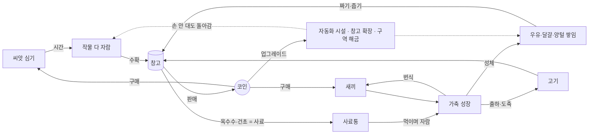

# 방치형 농장 게임 전환 계획

> 상태: **확정(2026-10-06)** — D1~D7은 모두 권장안으로 결정. 수치표는 [game-design.md](game-design.md).
> 작성 2026-10-06, 기준 버전 1.7.1. 작업은 `game-2.0` 통합 브랜치에 모으고 main은 1.7.x 수정용으로 둔다.

## 1. 무엇을 바꾸나

지금 마이팜은 **실제 농장에서 일어난 일을 사람이 옮겨 적는 관리 도구**다. 우유·달걀 생산량을 직접 입력하고, 가축 체중·건강을 검진 때 적고, 장부에 실제 돈을 적고, 실제 날씨로 실제 물주기를 판단한다. 앱은 현실을 비추는 거울이라 사용자가 운영을 "하고 있는" 느낌이 아니라 "기록하고 있는" 느낌이 든다.

목표는 **시간이 흐르면 농장이 스스로 돌아가고, 나는 그 결과를 거두고 결정하는 방치형 게임**이다.

| | 지금(관리 도구) | 목표(방치형 게임) |
| --- | --- | --- |
| 무엇이 일어나나 | 사용자가 입력한 만큼 | 시간이 흐르면 자동으로(앱을 닫아도) |
| 작물 | 실제 파종일·재배 일수(46~180일)로 생육률 표시 | 심으면 분·시간 단위로 자라고, 다 자라면 수확 |
| 가축 | 체중·건강을 손으로 기록 | 새끼 → 성장 단계 → 성체. 우유·달걀·양털이 쌓이고 짜서 거둠. 출하(도축)해 고기로 판매, 번식 |
| 생산량 | 사용자가 매일 입력 | 시뮬레이션이 계산 |
| 돈 | 실제 원화 장부(세무 CSV) | 게임 코인. 판매로 벌고 씨앗·가축·시설에 씀 |
| 재고 | 손으로 입출고 | 창고: 수확·생산물이 들어오고 사료가 빠짐(용량 한도) |
| 알림 | 실제 할 일(물주기·급이·백신) | "다 자랐어요", "창고가 가득 찼어요", "젖 짤 때예요" |
| 성장감 | 없음 | 농장 레벨·구역 해금·자동화 시설 |

## 2. 목표 경험 — 핵심 루프

- **작물**: 빈 밭에 씨앗을 심으면 실시간으로 자란다. 물은 심을 때 한 번 쓰고(물탱크는 저절로 찬다), 모자라면 찰 때까지 심을 수 없다. 여러 번 열리는 작물(사과)은 다시 열리기 전에 물을 기다린다. 자라는 동안 죽거나 벌을 받지는 않는다(방치형은 벌주지 않는다). 수치는 [game-design.md](game-design.md) §3. 다 자라면 수확해 창고로 간다.
- **가축**: 새끼를 들이면 사료를 먹으며 자란다(새끼 → 청년 → 성체). 성체는 일정 주기로 생산물을 만들어 쌓는다(소 = 우유, 닭 = 달걀, 양 = 양털, 염소 = 우유). 쌓인 것은 짜거나 주워야 창고로 간다(상한이 있어 너무 오래 두면 더 안 쌓인다). 성체를 출하(도축)하면 고기가 되고, 암수가 있으면 새끼가 태어난다.
- **순환**: 옥수수·건초 작물이 사료가 되어 가축으로 이어진다. 사료가 떨어지면 가축 성장과 생산이 멈춘다(죽지 않는다).
- **방치**: 처음엔 직접 눌러 수확·착유하고, 코인으로 스프링클러·자동 수확기·자동 착유기를 들이면 손을 대지 않아도 돌아간다. 앱을 닫은 동안의 시간도 그대로 계산해서, 다시 열면 "자리 비운 동안" 요약을 보여 준다(오프라인 진행에는 상한을 두고 업그레이드로 늘린다).
- **진행**: 농장 레벨이 오르면 9개 구역이 차례로 열리고(처음엔 집·밭 하나·가축 구역), 작물·가축 종류가 늘어난다.

## 3. 지금 코드에서 살리는 것 / 바꾸는 것 / 버리는 것

| 영역 | 처리 | 내용 |
| --- | --- | --- |
| 농장 지도(도면 스타일 painter, 카메라, 구역 hit test, 접근성) | **살림** | 게임 화면의 중심. 구역 잠금 표시, 다 자란 작물·쌓인 생산물 표시를 덧그린다 |
| 동물 애니메이션·아바타 | **살림** | 성장 단계별 크기 차이 정도만 추가 |
| 저장(SharedPreferences + schemaVersion + 마이그레이션 + 보관본) | **살림** | 새 형식 v5 |
| 백업 내보내기/복원, 앱 안 업데이트, PC·태블릿 배치, ko/en, CI | **살림** | 그대로 |
| 로컬 알림(Android·Windows) | **살림·재정의** | 예약 대상을 게임 이벤트로 교체(계획 함수만 바꾸면 됨) |
| 날씨(Open-Meteo, 보관본·재시도) | **바꿈(가볍게)** | 실제 지역 날씨가 게임에 약하게 영향: 비 오면 물탱크 보너스 등. 정확한 위도·경도 입력 대신 지역 선택 |
| 작물 생육 계산 | **바꿈** | 실제 일 단위 → 게임 시간(분·시간), 정의 표 기반 |
| 가축 모델 | **바꿈** | 손으로 적는 체중·건강 → 성장 단계·사료·생산 누적·성별 |
| 생산 기록(우유·달걀 수동 입력), 급이 체크 | **버림 → 대체** | 시뮬레이션이 계산하고 사용자는 "짜기·줍기" |
| 재고 수동 입출고 | **버림 → 대체** | 창고(자동 입출고, 용량 한도) |
| 장부(실제 돈, 통화 선택, CSV, 세무 문구) | **버림 → 축소** | 게임 코인 수입·지출 기록(분석 탭 차트에 재사용) |
| 백신·진료 일정 | **버림** 또는 **가축 건강 이벤트**로 대체(D 미정, 1차 범위 밖) | |
| 오늘 할 일(자유 메모) | **버림 → 대체** | "할 수 있는 일"(수확 가능·짤 수 있음·창고 가득) 자동 목록 |

## 4. 설계 원칙

1. **결정적 시뮬레이션 엔진**: 순수 Dart로 `advance(state, from, to)` 하나가 경과 시간만큼 상태를 진행시킨다. 매 초 도는 루프가 아니라 "다음 사건 시각"을 계산해 건너뛰는 방식이라, 앱을 켜 둔 1시간과 닫아 둔 1시간이 같은 식으로 계산된다.
   - 검증 기준(속성 테스트): 10분씩 6번 나눠 진행한 결과 = 1시간을 한 번에 진행한 결과.
   - 기기 시계가 거꾸로 가면(시계 변경) 진행하지 않는다. 싱글플레이라 시계 앞당기기 치트는 막지 않는다(결정 D6과 연관).
2. **데이터 주도 정의 표**: 작물·가축·시설의 성장 시간, 생산 주기, 가격, 해금 레벨을 코드가 아니라 표(Dart 상수 표 → 필요하면 JSON)로 둔다. 밸런스 조정이 코드 수정이 되지 않게.
3. **저장 형식 v5(새 GameState)**: 기존 관리 데이터는 지우지 않고 정리 대상이 아닌 별도 보관 키에 원문 그대로 남기고, 설정 화면에서 1.x 백업 파일로 내보낼 수 있게 한다(1.7.x에서 복원 가능). 새 게임은 농장 이름만 이어받아 처음부터 시작한다(D7). 백업 파일은 새 형식으로 바뀌고, 이전 형식 백업은 "관리 앱 시절 백업"으로 알아보고 거부한다.
4. **UI는 지도 중심**: 홈 = 농장 지도 + 상단 코인·레벨·창고 바 + "할 수 있는 일". 구역을 누르면 그 구역 행동(심기·수확·짜기·출하)이 아래 시트로 뜬다. 지금의 탭 구조(홈·농장·분석·수확·프로필)는 홈·창고/상점·통계·설정 정도로 줄인다.

## 5. 단계별 계획

각 단계는 하나 이상의 PR이고, 끝날 때 테스트 통과 + 에뮬레이터/실기 확인 + 문서 갱신이 완료 조건이다.

| 단계 | 목표 | 완료 기준 | 규모 |
| --- | --- | --- | --- |
| **0. 설계 확정** | D1~D7 결정, 수치표 v1(작물 5종·가축 4종·시설), 화면 흐름 스케치 | 수치표로 "첫 30분·첫 날·첫 주"에 무엇을 하게 되는지 설명 가능 | 문서 |
| **1. 시뮬레이션 코어** | `GameState`, 정의 표, `advance`, 저장 v5와 기존 데이터 보관, 단위·속성 테스트 | UI 없이 테스트로: 작물이 자라고, 가축이 자라 생산하고, 사료가 떨어지면 멈추고, 나눠 진행 = 한 번 진행 | 중 |
| **2. 작물 루프 (첫 플레이 빌드)** | 심기·자람·수확·판매, 코인·창고 바, 지도 위 다 자람 표시, 구역 시트 | 새로 깔면 씨앗을 심고 몇 분 뒤 수확해 팔 수 있다. 앱을 닫았다 열어도 자라 있다 | 중 |
| **3. 가축 루프** | 입식·성장 단계·사료 소비·생산 누적·짜기/줍기·출하(도축)·번식 | 송아지가 자라 우유를 만들고, 짜서 팔고, 출하하면 고기가 된다. 옥수수 → 사료 순환 | 대 |
| **4. 방치 요소** | 자동화 시설, 오프라인 진행 상한·"자리 비운 동안" 요약, 창고 한도, 알림 재정의 | 시설을 사 두면 손대지 않아도 코인이 쌓이고, 다시 열면 요약이 뜬다. 알림이 게임 이벤트로 온다 | 중 |
| **5. 진행·밸런스** | 레벨·경험치, 구역 해금, 시세 변동(+날씨 영향), 수치 조정 | 사용자가 하루 이상 직접 플레이해 지루하거나 막히는 구간이 없다 | 중(반복) |
| **6. 정리·출시 2.0.0** | 관리 기능 제거, README·소개 페이지·스크린샷·Play 키트·개인정보처리방침 재작성, 마이그레이션 실기 확인 | 1.7.x에서 2.0.0으로 앱 안 업데이트해도 크래시 없이 새 게임이 시작되고 옛 기록은 보관된다 | 중 |

**3단계가 끝나면** 사용자가 직접 플레이해 보고 방향을 다시 확인한다(재미 검증 전에 4~5단계를 쌓지 않는다). 처음에는 2~3단계 사이로 잡았지만, 작물만으로는 가축(착유·출하)을 포함한 핵심 재미를 확인할 수 없어 3단계 뒤로 옮겼다.

## 6. 결정 사항 (2026-10-06 모두 권장안으로 확정)

| # | 질문 | 권장 | 이유 |
| --- | --- | --- | --- |
| D1 | 지금 앱을 게임으로 **전면 전환**할지, **별도 앱**으로 만들지 | 전면 전환(같은 패키지 `com.jeiel85.myfarm`, 2.0.0) | 첫 공개 릴리스가 오늘이라 기존 사용자가 사실상 없다. Play 패키지명 등록·서명 키·업데이트 경로를 그대로 쓴다. 관리 앱은 `v1.7.1` 태그로 남는다 |
| D2 | 시간 감각 | 작물: 초반 1~10분, 후반 1~4시간 / 가축: 성체까지 30분~하루, 생산 주기 5분~1시간 | 방치형은 "잠깐 들어와 거두기"가 하루 여러 번 일어나야 한다 |
| D3 | 직접 조작 vs 완전 자동 | 초반은 눌러서 수확·짜기, 시설 업그레이드로 자동화 | 자동화 자체가 성장 목표가 된다 |
| D4 | 도축 표현 | "출하(정육)" 버튼과 고기 아이콘만, 장면·피 표현 없음 | 연령 등급 영향 최소화. 문구는 "도축" 대신 "출하"를 기본으로(설정 불필요) |
| D5 | 실제 날씨 연동 | 가볍게 유지(비 = 물 보너스, 폭염 = 생산 약간 감소). 지역은 목록에서 선택 | 이미 있는 기능을 살리면서 매일 들어올 이유가 된다 |
| D6 | 수익 모델·치트 | 광고·결제 없음 유지, 시계 조작은 막지 않음 | 지금 원칙(분석·광고 SDK 없음)과 같다. 넣으려면 별도 결정과 개인정보처리방침 변경이 필요 |
| D7 | 기존 기록 | 새 게임으로 시작(농장 이름만 이어받음), 옛 기록은 앱 안 보관본 + 백업 파일로 남김 | 관리 기록(실제 우유량, 실제 돈)을 게임 수치로 바꾸는 의미 있는 변환이 없다 |

## 7. 위험과 대응

- **재미는 수치에서 나온다**: 코드보다 수치표가 더 중요하다. 0단계 수치표를 문서로 남기고, 2·3단계 끝에 사용자가 직접 플레이해 조정한다.
- **오프라인 진행 오류**(시간이 두 번 계산되거나 빠짐): 엔진을 UI와 분리하고 속성 테스트로 막는다.
- **범위 팽창**: 방치형은 콘텐츠를 계속 요구한다. 1차 출시는 지금 있는 작물 5종·가축 4종·9구역으로 한정하고, 나머지는 BACKLOG로 보낸다.
- **이미 만든 문서·키트의 재작성**: README, 소개 페이지, 스크린샷, Play 등록정보 문구, 데이터 보안 초안, 개인정보처리방침이 모두 "관리 앱" 기준이다. 6단계에서 함께 바꾼다. Play **패키지명 등록**은 앱 내용과 무관하므로 그대로 진행해도 된다.
- **Play 정책**: 등록정보를 만들 때 카테고리가 "생산성"에서 "게임 > 시뮬레이션"으로 바뀌고, 콘텐츠 등급 설문을 다시 해야 한다(도축 표현은 D4로 최소화).
- **저장 형식 변경은 되돌리기 어렵다**: v5 전환 전에 백업 내보내기를 홈에서 한 번 더 권하고, 옛 데이터를 지우지 않는다(AGENTS.md §11).

## 8. 그래픽 방향 (2026-10-06 추가)

사용자 요청: 탑다운은 유지하되 더 예쁘게. 1.7.0의 "농지 도면"은 차별화에는 좋았지만 게임으로는 차갑다. 다만 밝은 원색 카툰으로 돌아가면 원본과 닮아지는 문제가 다시 생긴다.

- 방향: **수채 그림책 탑다운** — 종이 결 위에 번지는 물감 얼룩, 흔들리는 손그림 갈색 선, 부드러운 그림자, 따뜻한 빛.
- 게임에 필요한 정보를 그림에 담는다: 작물 성장 단계(싹 → 잎 → 열매), 다 자람·쌓인 생산물 표시, 잠긴 구역.
- 앱 팔레트(잉크 블루·테라코타·세이지·황토)는 유지하고 지도만 채도를 조금 올린다.
- 2단계에서 지도 painter를 이 스타일로 다시 그린다. 시안은 사용자에게 보냈고, 의견에 따라 조정한다.

## 9. 다음 단계

0단계 수치표 v1을 [game-design.md](game-design.md)에 썼다. 1단계(시뮬레이션 코어)부터 `game-2.0` 브랜치에서 진행한다.

**진행 상황(2026-10-06)**: 0~3단계 완료(엔진 #18, 화면은 game-2.0으로 가는 PR). 4단계 일부를 앞당겨 넣었다: "자리 비운 동안" 요약, 창고 한도, 알림 재정의(작물 다 자람·생산물 가득·사료 바닥). 지금은 **사용자 플레이테스트 대기**이며, 의견을 받은 뒤 4~5단계로 넘어간다.

계획과 다르게 단순화한 것(플레이테스트 뒤 다시 판단):
- 번식은 성별 없이 "어른 두 마리 + 우리 자리"로 정했다(수치표 §4).
- 출하하면 고기 물건이 아니라 바로 코인을 받는다(고기 판매 단계를 한 번 줄임).

## 10. 플레이테스트 1차 (2026-10-07, Windows 빌드 be3e37b)

받은 의견과 반영 결과. 사용자 요청으로 P1은 나머지 의견을 기다리지 않고 바로 반영했다.

| # | 의견 | 원인 | 반영 안 |
| --- | --- | --- | --- |
| P1 | 처음 몇 분이 지루하고 할 게 없다. 사료를 먼저 다 사 버렸다 | 1레벨은 밭 1개·상추(2분)뿐이라 2분마다 두 번 누르고 기다림. 2레벨(경험치 15)까지 붙어 있어도 15분쯤. 처음 사료 60이면 닭 2마리가 약 15시간 버티는데 화면이 알려 주지 않아 코인을 사료에 쓰게 됨 | **반영**: "초반은 쉽게, 갈수록 완만하게"(사용자 의견)에 맞춰 레벨 경계를 5·15·35·75·150·280·480·780·1200으로 바꿈(2레벨 몇 분, 3레벨 10분 안팎, 4레벨 20분 안팎). 밭 2는 2레벨 + 30코인, 밭 3은 3레벨 + 100코인. 사료 화면에 "지금 사료로 약 N시간 · 한 묶음은 약 M시간 분량" 표시. 초반 목표(퀘스트) 목록은 5단계 후보 |

아직 받지 않은 항목: 옥수수 → 사료 → 가축 흐름, 출하 보상·번식 속도, 번식 성별·출하 즉시 코인 유지 여부, 지도 닭 크기, "자리 비운 동안" 요약.

## 11. 날씨와 하루 (2026-10-07)

사용자가 원본 게시물의 날씨 애니메이션 영상을 보여 주며 "다르게 만들 여지를 최대한 반영해서" 구현을 요청했다. 수치·규칙은 [game-design.md](game-design.md) §10.

- **D5를 바꿨다**: "실제 지역 날씨가 게임에 약하게 영향"에서 **날짜·시각으로 정해지는 게임 날씨**로. 엔진이 오프라인 시간을 분 단위로 다시 계산하므로 지나간 시각의 날씨를 언제든 같은 값으로 알아야 하는데, 실제 날씨로는 이를 보장할 수 없다. 위치를 보내지 않아도 되는 이점도 있다. 효과도 "폭염 = 생산 약간 감소" 대신 "폭염 = 물 충전 감소"로 했다(생산 진행을 분 단위 정수로 다루는 지금 구조에서 단순하고 결정적). 실제 날씨를 그림에만 덧입히는 것은 BACKLOG.
- 원본과 겹치지 않게 한 것: 시점(옆 → 위에서 본 수채 지도), 날씨 화면을 따로 두지 않음, 날씨 바꾸기 버튼 줄 대신 시트 안 미리 보기, 게임 효과(비·폭염·무지개 보너스), 밤낮·반딧불·동물 대피, 한국 계절 날씨, 문구·색.
- **입체 농장(2026-10-07)**: 사용자가 영상처럼 하늘이 보이는 입체감을 원해, 지도판을 눕힌 디오라마 + 하늘 띠(A안)로 하고 구조물·나무·동물을 세워 그렸다. 진짜 3D(엔진·모델)는 의존성·제작량·저사양 성능 때문에 하지 않았다. 하늘·언덕 구도는 원본과 닮아질 수 있어, 수채 산 능선·함석지붕 외양간·시각을 따르는 해달·계절 변화로 차이를 유지한다.

